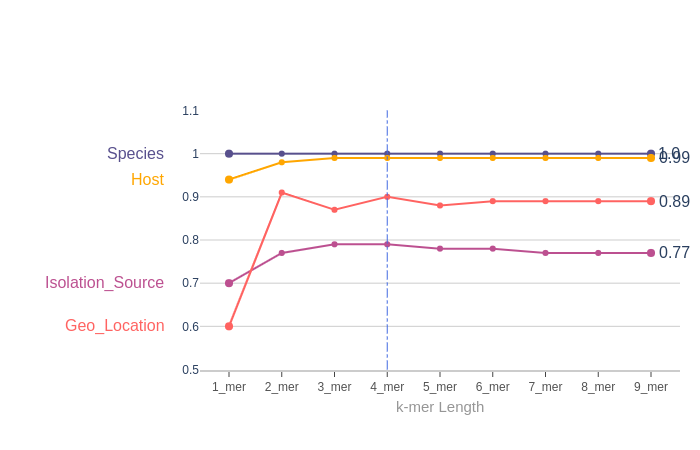
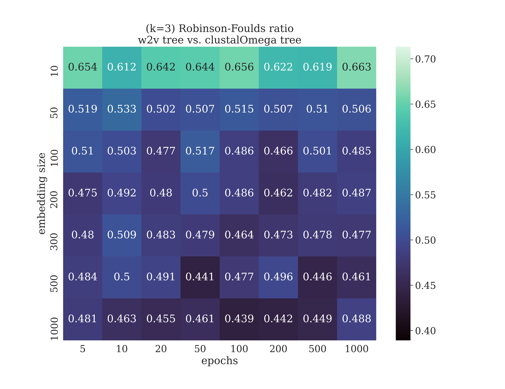
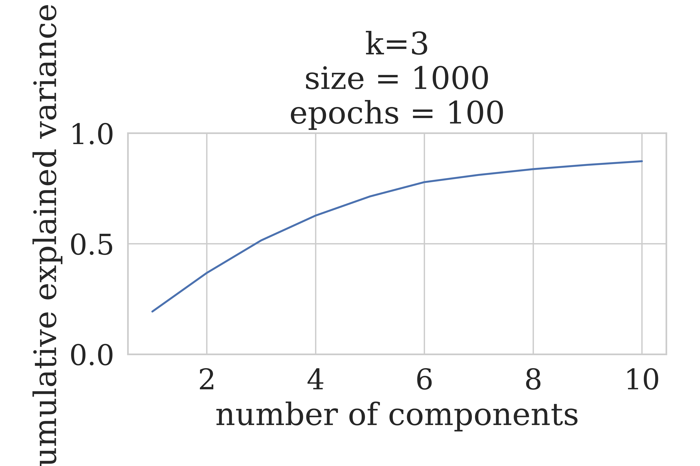

# Introduction

In late 2019, a previously unknown virus began spreading within the population of the Wuhan-city in the Hubei province of China [@Huang-Jan2020]. The virus, identified as a new type of coronavirus [@WHO-sitrep1], has since spread over the globe as a pandemic of an unprecedented scale [@WHO-press-pandemic,@WHO-sitrep78].

Through a global effort, a number of virus samples have been fully sequenced, with the data deposed in publicly accessible repositories, such as the [SARS-CoV-2 sequences GenBank](https://www.ncbi.nlm.nih.gov/genbank/sars-cov-2-seqs/) and the [EBI Data](https://www.ebi.ac.uk/ena/pathogens/covid-19).

Given the high similarity of the sequences, both at the aminoacid and the nucleotide level, a key question is how to identify interesting / discriminating features across the different sequences, so that the underling structure of the evolutionary story of the virus can be highlighted.

In order to address this question, the Machine Learning group of the [COVID-19 Biohackathon](https://github.com/virtual-biohackathons/covid-19-bh20), defined the following tasks:

- Identify potential features at the nucleotide level based on the k-mers (for various k)
- Identify potential features at the aminoacid level, based on the AA frequencies (and for various word sizes)
- Perform in-silico estimates of epitopes for COVID19
- Identify patterns in secondary structure (e.g. vs random sequences)

Each task, and the corresponding outputs are detailed below.

# Methods

## Determination of optimal amino acid k-mer size for orf1ab feature extraction.
The SARS-CoV-2 orf1ab sequences and metadata were obtained from [NCBI Virus](https://www.ncbi.nlm.nih.gov/labs/virus/vssi/#/). A processed version used in this study can be found here ([fasta](https://github.com/covid19-bh-machine-learning/master/blob/master/data/coronavirus_orf1ab.fasta), [metadata](https://github.com/covid19-bh-machine-learning/master/blob/master/data/coronavirus_orf1ab_meta.csv)). The nucleotide sequences were translated using Biopython[@10.1093/bioinformatics/btp163] package. After the translation, the amino acid sequences were fragmented into k-mers of size 1 to 9. We took up four classification tasks  (Species, Host, Geographical Location, and Extraction Source)  based on the available labeled data. To be included in the classification task, the particular label should have represented at least 20 times in the whole dataset of 2384 unique sequences by accession. 

k-mers were embedded with CountVectorizer and fitted on logistic regression using the scikit-learn[@scikit-learn] package. Model performances were evaluated using a weighted average of precision, recall, and F1-score across the test data.
    
## Potential features at the nucleotide level based on the k-mers

This approach focuses on the detection of k-mers that appear with high frequency in the data. The main dataset that was used for feature extraction is https://github.com/covid19-bh-machine-learning/master/blob/master/data/sars_cov_2_fixed.fasta and is actually a set of 281 genome sequences of SARS-CoV-2, each one consisting of approximately 30.000 nucleotides. The correspoding meta-data set is https://github.com/covid19-bh-machine-learning/master/blob/master/data/sars_cov_2_fixed_meta.csv and contains information about the length of each sequence, geographical location, isolation source, collection date of the sample etc.

The analysis that was conducted is an algorithmic procedure based on a pruning tree, which dynamically evaluates k-mers of different lengths and keeps those with the highest evaluation, while at the same time kmers with low evaluation are rejected. The evaluation parameter depends both on the length of each k-mer and its frequency in the data. In this way, the most significant k-mers are isolated within a very decent time and can be used as features in our data. 

The analysis was conducted in two different ways. In the first approach the algorithm was applied to each sequence separately. In this way, the repetitiveness of k-mers within a single sequence was examined. The data that were extracted from this analysis have been joined with the meta data in a single data matrix (https://github.com/covid19-bh-machine-learning/master/blob/master/kmerClusteringData/kmer_analysis_and_mata_data_merged.csv). The elements below the k-mer columns correspond to the frequency of each k-mer within a single sequence. 

In the second approach, the algorithm was applied to the total data set and, thus, genome sequencies were treated as a single set. K-mers that appear with high frequency within all the genome sequences were successfully isolated in an output k-mers set. The next step was to remove all k-mers that appeared to every sequence from this output set, in order to reduce the dimensionality of the problem. The data that were extracted from this analysis have also been joined with the meta data set in a single data matrix (https://github.com/covid19-bh-machine-learning/master/blob/master/kmerClusteringData/kmer_analysis_and_meta_data__fixed_merged.csv). The elements below the k-mer columns are zeros and ones. One means that the current k-mer apperars in the corresponding sequence, while zero that it doesn't, as well. 

## Potential features at the aminoacid level, based on the AA frequencies

tbf -> t-SNE analysis, word2vec

### Continuous distributed representations

Biological sequence comparison is a well established way in inferring the relatedness of various organisms and the functional role of their components. In the last years there have been some efforts into representing biological sequences with new paradigms, especially by following Natural Language Processing methods, with the aim to capture the most meaningful information of the original sequences. Although more modern solutions are present in the world of NLP, like ELMo [@peters_2018_deep], BERT [@devlin_2018_bert], and so on, biological sequence representation still has much to explore [@kimothi_2016_distributed], especially in relation to the final task which has to be solved exploiting the new representation. One of the most successful word embedding-based models is the word2vec model [@mikolov_2013_efficient] for generating distributed representations of words and phrases. Some advances have been made with its standard application [@asgari_2015_continuous], both for DNA [@ng_2017_dna2vec], RNA [@yi_2020_learning] and protein [@asgari_2015_prot2vec] sequences. To briefly summarize those studies, the impact of projecting sequence data on embedded spaces is likely to reduce the complexity of the algorithms needed to solve certain tasks (_e.g._ protein family classification [@asgari_2015_prot2vec]). Moreover, this approach is promising to represent residue-level sequence contexts for potential phosphorylation sites and demonstrate its application in both general and kinase-specific phosphorylation site predictions [@xu_2018_phoscontext2vec].

Phylogenetics is the task of creating a phylogenetic tree which represents a hypothesis about the evolutionary ancestry of a set of genes, species or any other taxa. Many tree inference methods have been proposed and the current state-of-the-art approach is to perform tree inference through a two-step process of multiple sequence alignment (MSA) followed by statistical tree inference [@felsenstein_1988_phylogenies]. In this work we propose the use of continuous distributed representations for the protein sequences to create phylogenetic trees in an alignment-free manner, analyzing its strengths and weaknesses for this aim.

Our approach is inspired by previous works cited above, with the following characteristics:

- each protein sequence is treated as a sentence, made by overlapping words (k-mers) to incorporate some context-order information in the resulting distributed representation;
- the word size is 3, which seems to work properly to embed amino acid sequences for biological tasks [@cheng_2019_dmrpis, @yi_2020_learning];
- the sequence vector is defined as the arithmetic the mean of all its word vectors.

With this choices we must point that the sequence vector loses the concept of k-mer order, (i.e. the same vector can be obtained by the same k-mers shuffled) **but** the overlapping k-mers should have processed that "order" information down to their representations. That is, if there is a k-mer "SAN" there will certainly by a k-mer “-SA” and a k-mer “AN-” (where "-" is any aminoacid), and this is, in our view, a way of loosely preserving the k-mer order information in the sequence vector.

As word2vec model, we applied the continuous bag-of-words (CBOW) word2vec architecture, a shallow, two-layer neural network, which is trained to predict the current word by using a few sorrounding context words. This model is generally faster, therefore it is the preferred choice to have a scalable solution when a large corpus will be available for training. 

The data we analyzed was a collection of orf1ab AA sequences, [WHERE DO THEY COME FROM?]. We explored the hyper-parameter space trying several combinations of the following hyper-parameters: k-mers size, vector space dimension, number of epochs for the training.

  * embedding size: [3, 4]
  * embedding size: [10, 50, 100, 200, 300, 500, 1000]
  * training epochs: [5, 10, 20, 50, 100, 200, 500, 1000]

All the experiments were performed using Gensim [@ehek_2010_software] and Scikit-learn [@scikit-learn] libraries. In particular, we focused on the following pipeline:
- obtain a vectorial representations of the proteins;
- build a tree by using cosine distance between sequence vectors;
- compare it with the clustalOmega [@sievers_2013_clustal] generated tree by means of Robinson-Foulds distance;
- choose the best embedding by referring to the aforementioned distance, exploring the embedded space and the resulting tree by:
  * analyzing the embedded space by PCA
  * analyzing the embedded space by tSNE
  * exploring the resulting tree both with the full embedded space and with the first Principal Components

The comparison between the trees built on the embeddings and the clustalOmega tree is done to have an external validation: results should not be too different from standard phylogenetic trees but should still show variations, in order to point untracked similarities between SARS-CoV-2 and other _coronaviridae_.

### MHC class I and II binding affinity prediction

An integral part of the adaptive immune system is the presentation of antigen epitopes on the cell surface. The MHC is the tissue-antigen, which T cells bind to, recognize and self-tolerate. During this process the MHC molecules bind to both, the T cell receptor and glycoproteins CD4/CD8 (cluster of differentiation) on T lymphocytes. Additionally, interactions between the variable Ig-like domain of the TCR interacts with the antigen epitope located in the peptide-binding groove of the MHC molecule to trigger T cell activation. Hence, epitopes can be used to elicit specific immune response making them suitable for vaccine design [@https://www.frontiersin.org/articles/10.3389/fimmu.2018.00826/full]. To construct an epitope based vaccine it is therefore imperative to evaluate the MHC class I or II binding affinity for a given set of peptide candidates and a given set of alleles. 
To determine binding affinites of peptides to MHC molecules time consuming experiments such as competition experiments have to be carried out. In these experiments the peptide concentration, which leads to 50\% inhibition of a standard peptide is measured. This concentration is known as the IC50 value. MHC binding peptides are typically classified by resulting IC50 values of less than 500 nM. To allow for quick and free assessments of MHC class I and II binding affinities several machine learning based software packages have been released in recent years. All of them are based on experimentally verified databases of MHC molecule binders and non-binders, but differ in their algorithms, training datasets and accessibility [@https://www.ncbi.nlm.nih.gov/pmc/articles/PMC4654883/].
MHCNuggets, a MHC class I and II binding affinity predictor, is based on a deep neural network, which makes use of several long-short term memory (LSTM) units to facilitate fast and peptide length independent predictions. Moreover, the usage of transfer learning and allele clustering approaches to enable the confident prediction of rare alleles. The authors demonstrated that MHCNuggets has comparable prediction performance for both classes when compared to NetMHCPan, MHCFlurry and others, while being the fastest prediction method [@https://cancerimmunolres.aacrjournals.org/content/early/2020/02/04/2326-6066.CIR-19-0464].
MHCNuggets was applied within the EpitopePredict framework [@https://github.com/dmnfarrell/epitopepredict] using the predefined broad_coverage_mhc1 (26 HLA alleles providing broad coverage) and human_common_mhc2 (11 most prevalent HLA-DR alleles worldwide) allele sets for class I and II respectively on a set of 7773 spike proteins of common corona virus including SARS-CoV-2. 

# Results

Preliminary results include:

- analysis of the word2vec data
- 

## A k-mer length of four is sufficient to model the distribution of orf1ab sequences.
|  | 
|:--:| 
| *A line plot of weighted average F1-score for four different orf1ab amino acid sequence classification tasks (Y-axis labels) at various kmer lengths. Y-axis denotes F1-score and X-axis denotes k-mer lengths.The vertical dotted line indicates optimal k-mer length* |

### Continuous distributed representations

Initial results indicate that higher dimensional embeddings are better at capturing the complexity of the aminoacidic sequences in terms of the resulting tree. The best results against the clustalOmega tree are in fact obtained for the word2vec model for a k-mer length of 3, a vector size of 1000, trained for 100 epochs (fig. All subsequent analyses are related to this model.

|  | 
|:--:| 
| *Heatmap reporting for all the hyper-parameter combinations performed the Robinson-Foulds distance between the trees build on the embeddings and the clustalOmega tree for all the hyper-parameter combinations performed.* |

To understand how the underlying space is distributing its variability we performed a PCA up until 90% explained variance, and even if the best embedding required high dimensions (1000), the majority of the variance can be found in 10 Principal components.

|  | 
|:--:| 
| *Principal Component Analysis of the vector-space of the best model shows that the majority of the variance lies on few principal components.* |

In parallel we performed a tSNE in 2-dimensions to have an indication on how the groups of different virus species were clustered and if any confounding effect was present (e.g. clustering for country). By plotting only those species that were present no less than 5 times we can see that SARS-CoV-2 clusters near the bat coronavirus, as expected[IMAGE REF TSNE].

|  | 
|:--:| 
| *t-distributed stochastic neighbor embedding space in 2-dimension shows expected cluters.* |

No country-related clustering was evident.

|  | 
|:--:| 
| *t-distributed stochastic neighbor embedding space in 2-dimension confirms the absence of country as a confounding effect.* |

Those analyses were necessary to ensure that the embedding space was reflecting the underlying phylogeny that is usually caught by multiple alignment methods.

Finally, by using the cosine distance we built a distance tree and inspected the resulting clusters formed around SARS-CoV-2.

|  | 
|:--:| 
| *Distance tree from the best model, visualized using Interactive Tree Of Life (iTOL) ([@letunic_2019_interactive]).* |

As expected SARS-CoV-2 has as nearest neighbours: Pangolin coronavirus [@lam_2020_identifying], SARS-Co-V, and Bat coronavirus. There are not apparent unexpected neighbours, and the most distant species from SARS-CoV-2 is the porcine Deltacoronavirus, which actually has been seen as related to SARS-Co-V in a recent study [@boley_2020_porcine]. A possible explanation for these discrepancy could be attributed to the distance metric used in the evaluation of the tree,  which not incorporate the "importance" of each node in the tree. More studies are needed to explore more sensible distance metric, and the resulting best phylogenetic trees.

# Conclusion

We recommend to include some discussion or conclusion about your work. Feel free to modify the section title as it fits better to your manuscript.

# Future work

And maybe you want to add a sentence or two on how you plan to continue. Please keep reading to learn about citations and references.

For citations of references, we prefer the use of parenthesis, last name and year. If you use a citation manager, Elsevier – Harvard or American Psychological Association (APA) will work. If you are referencing web pages, software or so, please do so in the same way. Whenever possible, add authors and year. We have included a couple of citations along this document for you to get the idea. Please remember to always add DOI whenever available, if not possible, please provide alternative URLs. You will end up with an alphabetical order list by authors’ last name.

# Jupyter notebooks, GitHub repositories and data repositories
## Analysis of orf1ab dataset
- A dashboard for exploring orf1ab dataset.  
    - [data](https://github.com/covid19-bh-machine-learning/master/blob/master/data/coronavirus_orf1ab.fasta)  
    - [metadata](https://github.com/covid19-bh-machine-learning/master/blob/master/data/coronavirus_orf1ab_meta.csv)  
    - [Dashboard notebook](https://github.com/covid19-bh-machine-learning/master/blob/master/orf1ab-pyCode/orf1ab_dashBoard.ipynb)  
- K-mer feature extraction at the aminoacid level, based on AA frequencies.  
  Each dataset consists of 1 - 9-mers, and each K-mer has a corresponding `class, feature, weight` table, a `prediction` table and a classification report containing `F1, Precision, Recall` and averaged metrics for that specific classification task.
    - [Species level classification and feature extraction results.](https://www.kaggle.com/aneeshpanoli/biohackathon-covid-ml-orf1ab-offset0-species-kmers)  
    - [Host level classification and feature extraction results.](https://www.kaggle.com/dataset/df6dedfb9fb389432fba489bc9f9d5ed00e8c8456136f544946a049d0ddf3bb8)  
    - [Geographic location level classification and feature extraction results.](https://www.kaggle.com/dataset/2dd97c357e93bf0c016b5dd9a43696f3bf2f41d9e2c0d568d82716e06c7084de)  
    - [Extraction source level classification and feature extraction results.](https://www.kaggle.com/dataset/7a85f6005959cfc6caaa735bbf40baea1c8018625d8375392571df243e14da73)  
    

* Please add a list here
* Make sure you let us know which of these correspond to Jupyter notebooks. Although not supported yet, we plan to add features for them
* And remember, software and data need a license for them to be used by others, no license means no clear rules so nobody could legally use a non-licensed research object, whatever that object is

# Acknowledgements

This work was done within the [COVID-19 Biohackathon of April 2020](https://github.com/virtual-biohackathons/covid-19-bh20).

# References

Leave thise section blank, create a paper.bib with all your references.

# Notes, to be removed

## Tables, figures and so on

Please remember to introduce tables (see Table 1) before they appear on the document. We recommend to center tables, formulas and figure but not the corresponding captions. Feel free to modify the table style as it better suits to your data.

Table 1
| Header 1 | Header 2 |
| -------- | -------- |
| item 1 | item 2 |
| item 3 | item 4 |

Remember to introduce figures (see Figure 1) before they appear on the document. 

 
Figure 1. A figure corresponding to the logo of our BioHackrXiv preprint.

