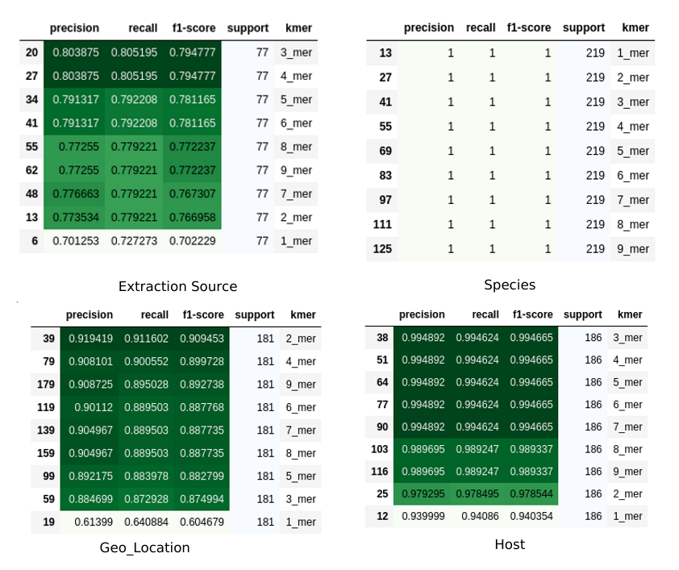
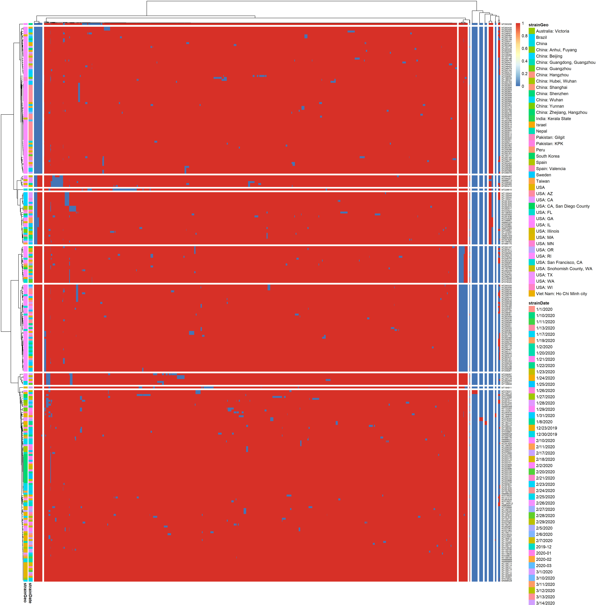
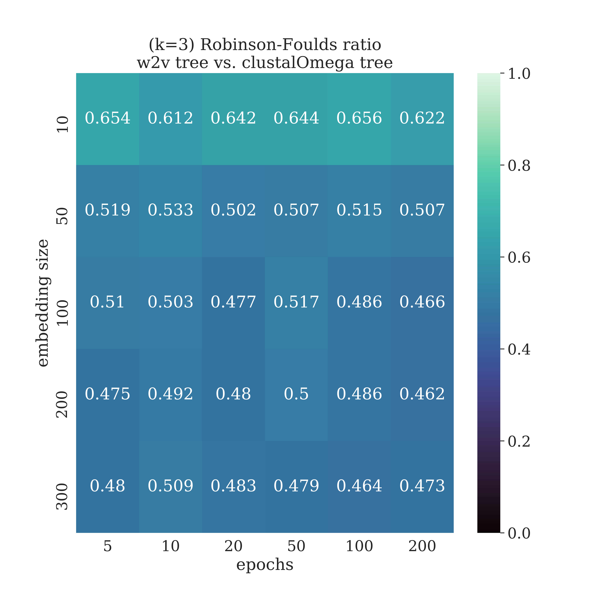
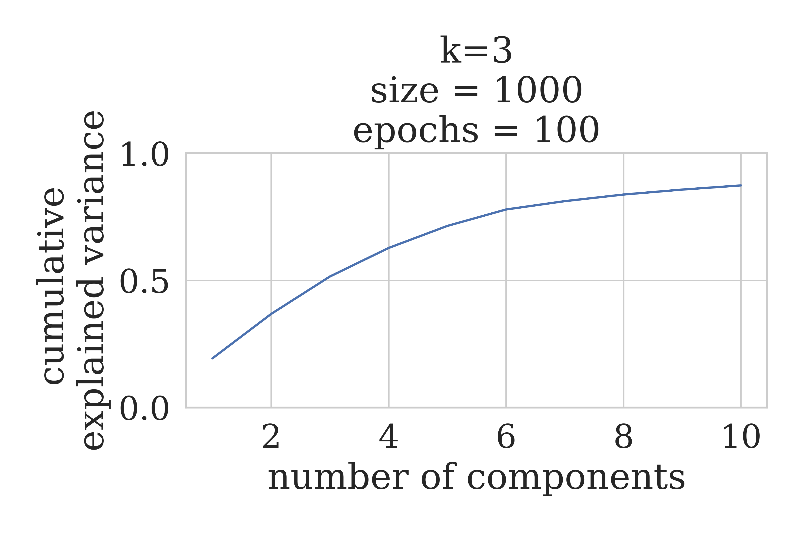
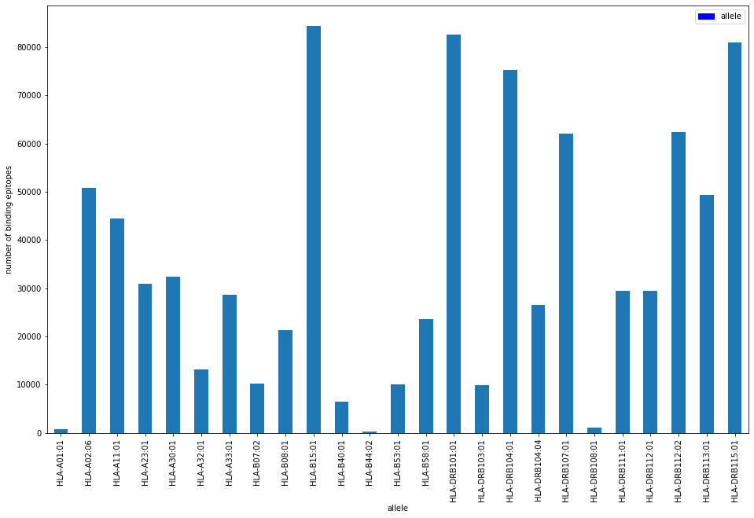
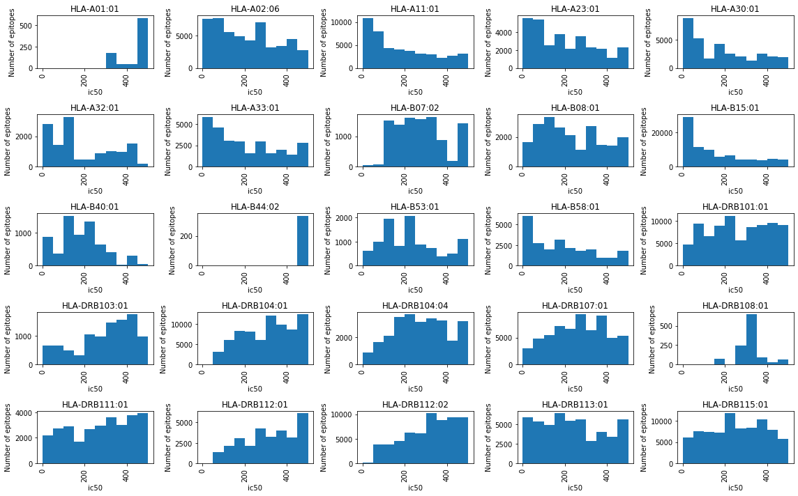
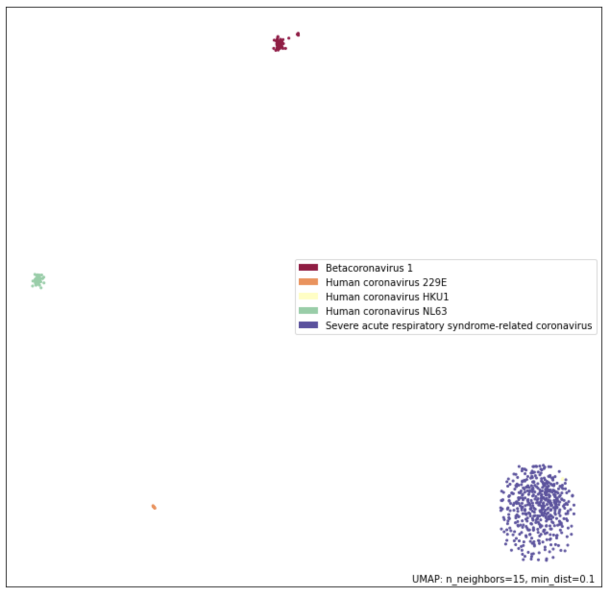
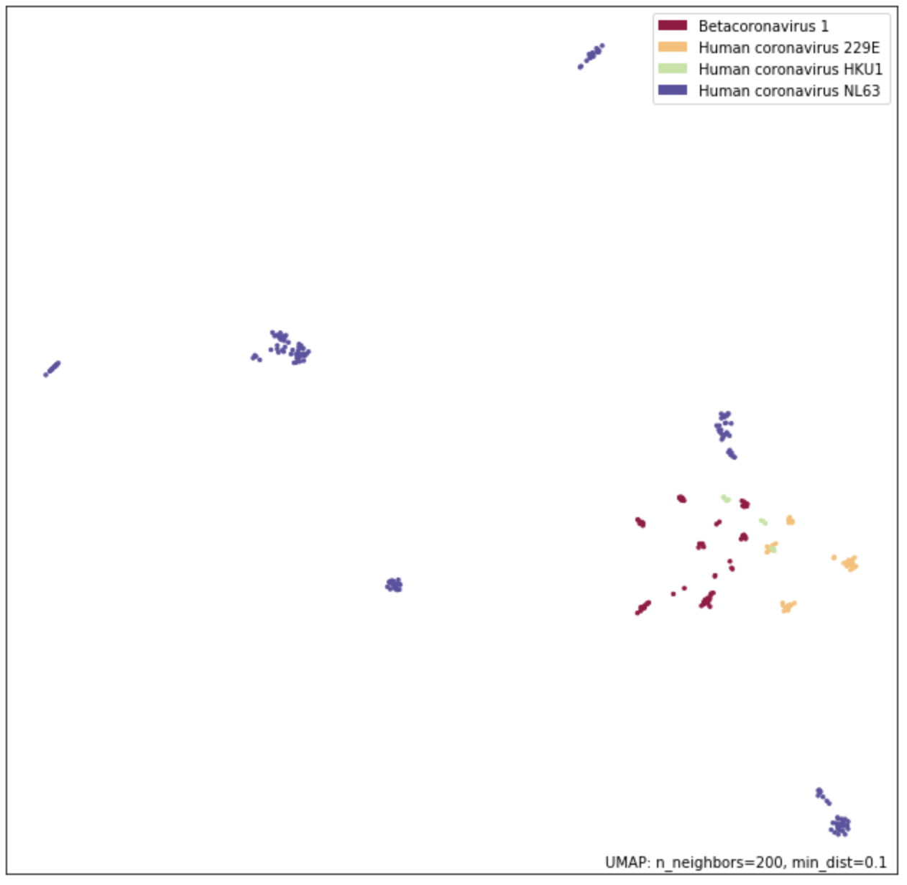

# Abstract

**Motivation:** The end of 2019 came with the emergence of a novel virus, identified as a new strain of Coronavirus, and has since spread over the globe as a pandemic of an unprecedented scale. A global collaborative effort has lead to a number of virus samples being fully sequenced, with the data disseminated by being published in publicly accessible repositories. Given the high similarity of the sequences, both at the aminoacid as well as the nucleotide levels, a key question arises as to how to identify interesting, discriminating features across the different sequences such that the underling structure of the evolutionary story of the virus can be highlighted. In this work we present our efforts in addressing this issue, through the systematic application of machine learning methods towards meaningful feature extraction.

**Results:** We applied a range of methods, in order to; identify the optimal word (k-mer) size for aminoacid patterns; identify k-mers features at the nucleotide level that have predictive value; construct continuous distributed representations for protein sequences in order to create phylogenetic trees in an alignment-free manner; and predict MHC class I and II binding affinity.

**Availability:** All data, code and results are available under permissive licenses (CC-BY or MIT) in the team GitHub repository [here](https://github.com/covid19-bh-machine-learning/master)

**Contact:** pdavis@mriglobal.org, fpsom@certh.gr

# 1. Introduction

In late 2019, a novel virus began spreading within the population of the Wuhan-city in the Hubei province of China [@Huang-Jan2020]. The virus, identified as a new strain of Coronavirus [@WHO-sitrep1], has since spread over the globe as a pandemic of an unprecedented scale [@WHO-press-pandemic,@WHO-sitrep78].

A global collaborative effort has lead to a number of virus samples being fully sequenced, with the data disseminated by being published in publicly accessible repositories, such as the [SARS-CoV-2 sequences GenBank](https://www.ncbi.nlm.nih.gov/genbank/sars-cov-2-seqs/) and the [EBI Data](https://www.ebi.ac.uk/ena/pathogens/covid-19).

Given the high similarity of the sequences, both at the aminoacid as well as the nucleotide levels, a key question arises as to how to identify features of interest across the different sequences, such that the underling structure of the viral evolutionary story can be highlighted.

In order to address this question, the machine learning group of the [COVID-19 BioHackathon](https://github.com/virtual-biohackathons/covid-19-bh20), defined the following tasks:

- Identification of the potential features at the nucleotide level based on the k-mers, for various _k_ values.
- Identification of the potential features at the aminoacid level, based on the AA frequencies, across various word sizes.
- Performance of in-silico estimates of epitopes for COVID19.
- Identification of patterns in secondary structure, compared to patterns evident in random sequences.

Each task, along with the corresponding outputs, is detailed hereinafter.

# 2. Approach

## 2.1. Data pre-Processing

Different publicly available resources were used as input for this study including the following:

- SARS-CoV-2 ORF1ab gene sequences and metadata for all _betacoronaviridae_ were obtained from [NCBI Virus](https://www.ncbi.nlm.nih.gov/labs/virus/vssi/#/).
- SARS-CoV-2 (COVID19) full assembly nucleotide sequences that have been identified in Humans were retrieved from [GenBank](https://www.ncbi.nlm.nih.gov/genbank/sars-cov-2-seqs/)

The processed version of all _betacoronaviridae_ sequences used in this study can be found here ([fasta](https://github.com/covid19-bh-machine-learning/master/blob/master/data/coronavirus_ORF1ab.fasta), [metadata](https://github.com/covid19-bh-machine-learning/master/blob/master/data/coronavirus_ORF1ab_meta.csv)). The nucleotide sequences were translated using Biopython[@10.1093/bioinformatics/btp163] package.

The processed version of all human virus sequences can be found [here](https://github.com/covid19-bh-machine-learning/master/blob/master/data/sars_cov_2_fixed.fasta) and comprises of a set of 281 genome sequences of SARS-CoV-2, each one approximately 30,000 nucleotides in length. The corresponding meta-data file is [here](https://github.com/covid19-bh-machine-learning/master/blob/master/data/sars_cov_2_fixed_meta.csv) and contains information about the length of each sequence, geographical location, isolation source, collection date of the sample etc.

## 2.2 Scope

In order to identify features of interest across the target sequences, and investigate their utility as potential predictors, we applied a range of methods including following:
1. Identification of optimal word (k-mer) size for aminoacid patterns
2. Identification of potential k-mers features at the nucleotide level
3. Continuous distributed representations for protein sequences inorder to create phylogenetic trees in an alignment-free manner
4. Prediction of MHC class I and MHC class II binding affinity

# 3. Methods

Each of the aforementioned methods is described concisely in the following sections.

## 3.1 Determination of optimal amino acid word size for ORF1ab feature extraction.

Using the processed version of all _betacoronaviridae_ SARS-CoV-2 ORF1ab sequences, the amino acid sequences were fragmented into words ranging from 1 to 9 in size. From within the available meta-data, we selected the following four fields as potential classification targets:
  - Species
  - Host
  - Geographical Location
  - Extraction Source

In order for a field to be included as a classification target, the particular label must have a representation of at least 20 within the entire dataset of 2,384 unique, by accession ID, sequences.

The produced words were embedded with `CountVectorizer` and fitted on logistic regression using the scikit-learn[@scikit-learn] package. Model performances were evaluated using a weighted average of precision, recall, and F1-score across the test data.

## 3.2 Potential features at the nucleotide level based on the k-mers

This approach focused on the detection of k-mers that appear with high frequency in the data. The primary dataset used for feature extraction was the set of 281 human SARS-CoV-2 virus sequences. The analysis was conducted is an algorithmic procedure based on a pruning tree, which dynamically evaluated k-mers of different lengths, keeping only those with the highest evaluation. The evaluation parameter depended on both; the length of each k-mer as well as its frequency in the data. In this way, the most significant k-mers were isolated within a very decent time and were able to be used as features in our data.

The analysis was conducted in two different ways:

- In the first approach, the algorithm was applied to each sequence separately. In this way, the repetitiveness of k-mers within a single sequence was examined. The data that were extracted from this analysis have been joined with the meta data in a [single data matrix](https://github.com/covid19-bh-machine-learning/master/blob/master/kmerClusteringData/kmer_analysis_and_mata_data_merged.csv). The elements below the k-mer columns correspond to the frequency of each k-mer within a single sequence.

- In the second approach, the algorithm was applied to the total data set and, thus, treating the genome sequences as a single set. K-mers that appeared with high frequency within all the genome sequences were successfully isolated in an output k-mers set. The next step was to remove all k-mers that appeared to every sequence from this output set, in order to reduce the dimensionality of the problem. The data that were extracted from this analysis have also been joined with the meta data set in a [single data matrix](https://github.com/covid19-bh-machine-learning/master/blob/master/kmerClusteringData/kmer_analysis_and_meta_data__fixed_merged.csv). It is indicated that the elements in the k-mer columns are zeros and ones, where 1 indicates that the current k-mer appears in the corresponding sequence, while 0 indicates absence.

## 3.3 Continuous distributed representations for protein sequences to create phylogenetic trees in an alignment-free manner

Biological sequence comparison is a well established method in inferring the relatedness of various organisms as well as the functional role of their components. In the last years, there have been some efforts into representing biological sequences with new paradigms, especially by Natural Language Processing methods hereinafter laid down, with the aim to capture the most meaningful information of the original sequences. Although more modern solutions are present in the NLP domain universe, including but not limited to ELMo [@peters_2018_deep] & BERT [@devlin_2018_bert], biological sequence representation still has much to explore [@kimothi_2016_distributed], especially in relation to the final task which was solved exploiting the new representation.

One of the most successful word embedding-based models is the word2vec model [@mikolov_2013_efficient] for generating distributed representations of words and phrases. Considerable advances have been made with its standard application [@asgari_2015_continuous], with the functionality being extended to modelling for DNA [@ng_2017_dna2vec], RNA [@yi_2020_learning] and protein [@asgari_2015_prot2vec] sequences. To briefly summarize those studies, the impact of projecting sequence data on embedded spaces is likely to reduce the complexity of the algorithms needed to solve certain tasks (_e.g._ protein family classification [@asgari_2015_prot2vec]). Moreover, this approach is promising to represent residue-level sequence contexts for potential phosphorylation sites and demonstrate its application in both general and kinase-specific phosphorylation site predictions [@xu_2018_phoscontext2vec].

Phylogenetics is the task of creating a phylogenetic tree which represents a hypothesis about the evolutionary ancestry of a set of genes, species or any other taxa. Many tree inference methods have been proposed and the current state-of-the-art approach is to perform tree inference through a two-step process of multiple sequence alignment (MSA) followed by statistical tree inference [@felsenstein_1988_phylogenies]. In this work we propose the use of continuous distributed representations for the protein sequences to create phylogenetic trees in an alignment-free manner, analyzing its strengths and weaknesses for this aim.

Our approach is inspired by previous works cited above, with the following characteristics:

- each protein sequence is treated as a sentence, made by overlapping words (k-mers) to incorporate some context-order information in the resulting distributed representation;
- the word size is 3, which seems to work properly to embed amino acid sequences for biological tasks [@cheng_2019_dmrpis, @yi_2020_learning];
- the sequence vector is defined as the arithmetic mean of all its word vectors.
- we also explored document representation via distributed memory (doc2vec) to directly generate sequences vectors[@DBLP:journals/corr/LeM14].

By defining the sequence vector as the arithmetic mean of all its word vectors we must point out that the sequence vector loses the concept of k-mer order, (i.e. the same vector can be obtained by the same k-mers shuffled) **but** the overlapping k-mers should have processed that "order" information down to their representations. That is, if there is a k-mer "SAN" there will certainly by a k-mer “-SA” and a k-mer “AN-” (where "-" is any aminoacid), and this is, in our view, a way of loosely preserving the k-mer order information in the sequence vector. Nonetheless, for this reason, we generated also sequence vectors via doc2vec which is intrinsically supposed to preserve k-mers order. However, using this architecture, we didn't obtain good models for our task (result not shown).

As word2vec models, two architectures are available: continuous bag-of-words (CBOW) and skip gram. These models are shallow,
two-layer neural networks that are trained to reconstruct semantic contexts of words. The CBOW model is trained to predict the current word by using a few surrounding context words. On the other hand, skip-gram uses the current word to predict the surrounding context words. In this work we applied the CBOW architecture, which is generally faster, therefore it is the preferred choice to have a scalable solution when a large corpus will be available for training. Importantly, the skip-gram architecture, in addition to result in a greater computational load for training the models, did not lead to significantly better models in our task (result not shown).

The data we analyzed was a collection of ORF1ab AA sequences from the NCBI, as previously mentioned [NCBI Virus](https://www.ncbi.nlm.nih.gov/labs/virus/vssi/#/) and [metadata](https://github.com/covid19-bh-machine-learning/master/blob/master/data/coronavirus_ORF1ab_meta.csv). We explored the hyper-parameter space trying several combinations of the following hyper-parameters: k-mers size, vector space dimension, number of epochs for the training.

  * embedding size: [3, 4]
  * embedding size: [10, 50, 100, 200, 300, 500, 1000]
  * training epochs: [5, 10, 20, 50, 100, 200, 500, 1000]

All the experiments were performed using Gensim [@ehek_2010_software] and Scikit-learn [@scikit-learn] libraries. In particular, we focused on the following pipeline:
- obtain a vectorial representations of the proteins;
- build a tree by using cosine distance between sequence vectors;
- compare it with the clustalOmega [@sievers_2013_clustal] generated tree by means of Robinson-Foulds distance;
- choose the best embedding by referring to the aforementioned distance, exploring the embedded space and the resulting tree by:
  * analyzing the embedded space by PCA
  * analyzing the embedded space by tSNE
  * exploring the resulting tree both with the full embedded space and with the first Principal Components

The comparison between the trees built on the embeddings and the clustalOmega tree is done to have an external validation: results should not be too different from standard phylogenetic trees but should still show variations, in order to point untracked similarities between SARS-CoV-2 and other _coronaviridae_.

## 3.4 MHC class I and II binding affinity prediction

An integral part of the adaptive immune system is the presentation of antigen epitopes on the cell surface. The MHC is the tissue-antigen which T-cells bind to, recognize and self-tolerate. During this process the MHC molecules bind to both the T-cell receptor and glycoproteins CD4/CD8 (cluster of differentiation) on T lymphocytes. Additionally, interactions between the variable Ig-like domain of the TCR interacts with the antigen epitope located in the peptide-binding groove of the MHC molecule to trigger T cell activation. Hence, epitopes can be used to elicit specific immune response making them suitable for vaccine design [@epitopediscovery]. To construct an epitope based vaccine it is therefore imperative to evaluate the MHC class I or II binding affinity for a given set of peptide candidates and a given set of alleles. Furthermore, determining the binding affinities for specific subgroups may aid researchers to focus on the most promising protein subunits, speeding up the vaccine development process.

To determine binding affinities of peptides to MHC molecules, time consuming experiments such as competition experiments have to be carried out. In these experiments the peptide concentration, which leads to 50\% inhibition of a standard peptide is measured. This concentration is known as the IC50 value. MHC binding peptides are typically classified by resulting IC50 values of less than 500 nM [@relationship_ba_immunogenicity]. To allow for quick and free assessments of MHC class I and II binding affinities several machine learning based software packages have been released in recent years. All of them are based on experimentally verified databases of MHC molecule binders and non-binders, but differ in their algorithms, training datasets and accessibility [@linus].

MHCNuggets, a MHC class I and II binding affinity predictor, is based on a deep neural network, which makes use of several long-short term memory (LSTM) units to facilitate fast and peptide length-independent predictions. Moreover, the usage of transfer learning and allele clustering approaches enable the confident prediction of rare alleles. The authors demonstrated that MHCNuggets has comparable prediction performance for both classes when compared to NetMHCPan, MHCFlurry and others, while being the fastest prediction method [@mhcnuggets].
MHCNuggets v2.3 was applied within the EpitopePredict framework v0.4 [@epitopepredict] using the predefined broad_coverage_mhc1 (26 HLA alleles providing broad coverage) and human_common_mhc2 (11 most prevalent HLA-DR alleles worldwide) allele sets for class I and II respectively on a set of 7773 subunit proteins of common corona virus including SARS-CoV-2.

The resulting epitope predictions and predicted binding affinities were used to for clustering using UMAP [@UMAP_learn]. UMAP operates under the assumptions that the data are uniformly distributed on a Riemannian manifold, that the Riemannian metric is locally constant, and that the manifold is locally connected. This allows UMAP to find a low dimensional projection of the data, which is equivalent to a fuzzy topological structure. UMAP has been demonstrated to retain more of the global structure than, for example, t-SNE, while having a lower run time [@UMAP].

# 4. Results and Discussion

Preliminary results include:

## 4.1 A k-mer length of four is sufficient to model the distribution of ORF1ab sequences.

We obtained the weighted averaged F1-score in different context of the data to explore the use of k-mer lengths to extract features from the ORF1ab aminoacid sequences for classification tasks. The plot shows that the species and host context are highly separable using aminoacid sequence. Geolocation has the best F1-scores at two and four k-mers. The isolation source context also shows there are differences on sequences that four k-mer length captures better. A four k-mer length presented the optimal scores to classify the test data on the different chosen context in combination.  

This table shows the weighted average metrics across the test data for four classification task depending on the context.

## 4.2 Nucleotide k-mer features as potential predictors

Using the [single data matrix](https://github.com/covid19-bh-machine-learning/master/blob/master/kmerClusteringData/kmer_analysis_and_meta_data__fixed_merged.csv) representation of the k-mer-based feature, we applied hierarchical clustering across both sequences and features. As shown in the figure above, there is a distinct clustering of sequences - notably, the reference sequence (_AccID: NC_045512_) is clustered together with several other sequences, but at the same time, there are a few singletons as outliers, that should be investigated further.

Additionally, it is equally important to note that in this analysis all derived features were utilized. However, it is evident that the feature variance (column) is very limited, which implies that the corresponding set of predictors will be significantly smaller.

## 4.3 Continuous distributed representations results

Initial results indicate that higher dimensional embeddings are better at capturing the complexity of the aminoacidic sequences in terms of the resulting tree. The best results against the clustalOmega tree are in fact obtained for the word2vec model for a k-mer length of 3, a vector size of 1000, trained for 100 epochs. All subsequent analyses are related to this model. In addition, we briefly investigated the robustness of the method by analyzing the second-best model and all the following results were maintained (data not shown):

To understand how the underlying space is distributing its variability we performed a PCA up until 90% explained variance, and even if the best embedding required high dimensions (1000), the majority of the variance can be found in 10 Principal components.

In parallel we performed a tSNE in 2-dimensions to have an indication on how the groups of different virus species were clustered and if any confounding effect was present (e.g. clustering for country). By plotting only those species that were present no less than 5 times we can see that SARS-CoV-2 clusters near the bat coronavirus, as expected.

No country-related clustering was evident.

Those analyses were necessary to ensure that the embedding space was reflecting the underlying phylogeny that is usually caught by multiple alignment methods.

Finally, by using the cosine distance we built a distance tree and inspected the resulting clusters formed around SARS-CoV-2, visualized using Interactive Tree Of Life (iTOL) [@letunic_2019_interactive].

As expected SARS-CoV-2 has as nearest neighbours: Pangolin coronavirus [@lam_2020_identifying], SARS-Co-V, and Bat coronavirus. There are not apparent unexpected neighbours, and the most distant species from SARS-CoV-2 is the porcine _Deltacoronavirus_, which actually has been seen as related to SARS-Co-V in a recent study [@boley_2020_porcine]. A possible explanation for this discrepancy could be attributed to the distance metric used in the evaluation of the tree,  which does not incorporate the "importance" of each node in the tree. More studies are needed to explore a more sensible distance metric, and the resulting best phylogenetic trees.

## 4.4 Epitope predictions suggest important variation by HLA allele and viral subunit protein

Out of 3730 sequences of the common corona virus sequences dataset, with an average AA sequence length of 414, MHCnuggets identified 867,231 epitopes as binding (using a theshold of IC50<500).

For the alleles, which have predicted binders, the number of strong and weak binders is not evenly distributed. HLA-B15:01, HLA-A11:01, HLA-A23:01, HLA-A30:01, and HLA-A33:01 seem to contain many strong binders, indicating that populations which cover these specific alleles well may respond strongly to vaccines based on the respective epitopes.

The space of predicted epitopes and IC50 values were explored with UMAP clustering. For this purpose, an approach analogous to one hot encoding was used. For each of the original 3730 sequences a vector was generated with length equal to the number of distinct (predicted) allele-epitope pairs. As with one hot encoding, a 0 was used to indicate that a given allele-epitope was not predicted for the sequence. However, instead of using a 1 to indicate the prediction of an allele-epitope pair for a given sequence, the inverse of the IC50 value was used (1/IC50). This was done to include some information about predicted binding affinities. Future work could expand on this by using more direct representations of predicted immunogenicity and screening out epitopes resembling self-peptides.

The UMAP clustering of the predicted epitope space yielded some interesting results that warrant further investigation. In particular, it suggested very little within-species variation of the immune-presentation of envelope and membrane proteins.

On the other hand, it suggests a great deal of variation in the immune-presentation of the spike proteins, even within species.

If confirmed these results would have implications on potential immunotherapies as well as the effectiveness of subunit vaccines against within-species variants of the virus.

# 5. Conclusion

Based on the analysis so far, some broad conclusions can be derived.

## Using constructed sequence features as a predictor set

All utilized methods produced promising results; species and host context are highly separable using aminoacid sequence, there are unique nucleotide-based k-mers that can be potentially used as additional predictors in a classification scheme, and the application of a "bag-of-words" model across RNA secondary structures leads to a small number of word structures that have non-zero coefficients.

## Continuous distributed representations

The alignment-free approach shows promising features, including the ability to mirror the standard alignment methods in recognizing the nearest neighbours of a long sequence. The ideal behaviour was to be halfway between the classic phylogenetic trees and new information, and the tree distance used to assess the best model is crucial at this step. The Robinson-Foulds distance may have been too generic to grasp the details needed to be used as an objective function (the best model in this work is the one which minimizes the RF distance), and while _easier_ features are present, like the nearness to SARS-Co-V, bat and pangolin, more subtle similarities are still not caught.
The reason for this, in our opinion, should be searched in the human made choices (_e.g._ objective functions and hyperparameter search strategies), not in the method itself, which has yielded promising results, mirroring classical results with an alignment-free approach.

## Predicted epitope feature space

The cursory analysis of the feature space of predicted epitopes suggests two salient results. First, it suggests that there is a great deal of variation in immunopresentation by HLA allele. Secondly, it suggests that viral protein subunits have very different degrees of variation in how they are presented, with respect to epitopes and predicted binding affinity. Both of these results, if confirmed, would have profound implications for vaccine design. Further exploration is warranted. Avenues for improvement would include using HLA allele-specific thresholds for binding prediction and removing epitopes with high similarity to known self-peptides.

## Future work

This report reflect the work initiated within the [COVID-19 BioHackathon of April 2020](https://github.com/virtual-biohackathons/covid-19-bh20) and mostly performed during the event itself. However, there are several interesting outcomes, and the authors are committed in further pursuing them. Specifically:
- the report will be considered for a submission to a conference
- the code produced in the context of this effort will continue to be developed, aiming for a full automated toolkit for feature extraction.

# GitHub repository, Jupyter notebooks, tools and data repositories

## GitHub repository

All the work presented here is available in our [GitHub repository](https://github.com/covid19-bh-machine-learning/master) under the MIT license.

## Analysis of ORF1ab dataset
- A dashboard for exploring ORF1ab dataset. 
    - [data](https://github.com/covid19-bh-machine-learning/master/blob/master/data/coronavirus_ORF1ab.fasta) 
    - [metadata](https://github.com/covid19-bh-machine-learning/master/blob/master/data/coronavirus_ORF1ab_meta.csv) 
    - [Dashboard notebook](https://github.com/covid19-bh-machine-learning/master/blob/master/ORF1ab-pyCode/ORF1ab_dashBoard.ipynb) 
- K-mer feature extraction at the aminoacid level, based on AA frequencies. 
  Each dataset consists of 1 - 9-mers, and each K-mer has a corresponding `class, feature, weight` table, a `prediction` table and a classification report containing `F1, Precision, Recall` and averaged metrics for that specific classification task.
    - [Species level classification and feature extraction results.](https://www.kaggle.com/aneeshpanoli/biohackathon-covid-ml-ORF1ab-offset0-species-kmers) 
    - [Host level classification and feature extraction results.](https://www.kaggle.com/dataset/df6dedfb9fb389432fba489bc9f9d5ed00e8c8456136f544946a049d0ddf3bb8) 
    - [Geographic location level classification and feature extraction results.](https://www.kaggle.com/dataset/2dd97c357e93bf0c016b5dd9a43696f3bf2f41d9e2c0d568d82716e06c7084de) 
    - [Extraction source level classification and feature extraction results.](https://www.kaggle.com/dataset/7a85f6005959cfc6caaa735bbf40baea1c8018625d8375392571df243e14da73) 

# Acknowledgements

This work was done within the [COVID-19 BioHackathon of April 2020](https://github.com/virtual-biohackathons/covid-19-bh20).

# References
